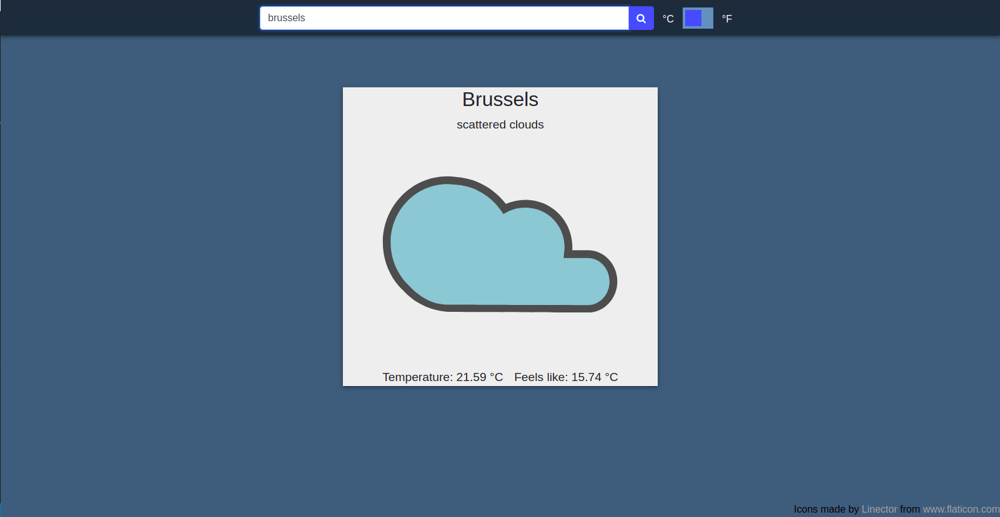

# Javascript weather app

This project was developed to practice asynchronous calls and working with APIs.

## Built With

- Javascript
- npm
- webpack 

## How to deploy
Upload index.html and main.js to your server. Access the page by going to the index.html address.

## Author

👤 **Miguel Dubois**

- Github: [@MiguelDP4](https://github.com/MiguelDP4)
- Twitter: [@Mike_DP4](https://twitter.com/Mike_DP4)
- LinkedIn [Miguel Dubois](https://www.linkedin.com/in/miguel-angel-dubois)

## Live Demo

You can check a demo version of the project in [this link](https://raw.githack.com/MiguelDP4/js-weather-app/feature/dist/index.html).

### Images

#### Application Screenshot

## 🤝 Contributing

This project is for learning purposes only, I wont accept contributions, though suggestions are welcome.

## Show your support

Give a ⭐️ if you like this project!

## Acknowledgments

- I thank microverse for this learning opportunity.
